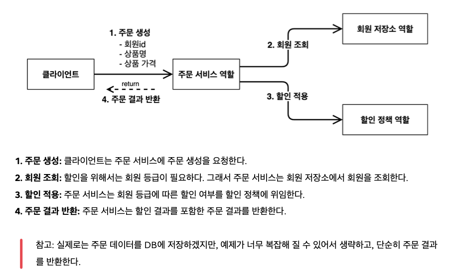
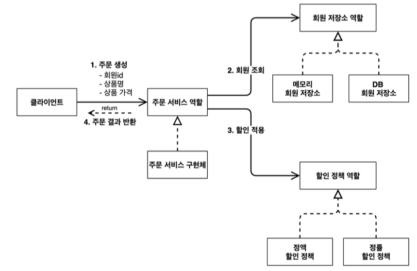
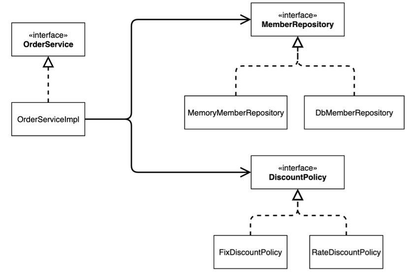
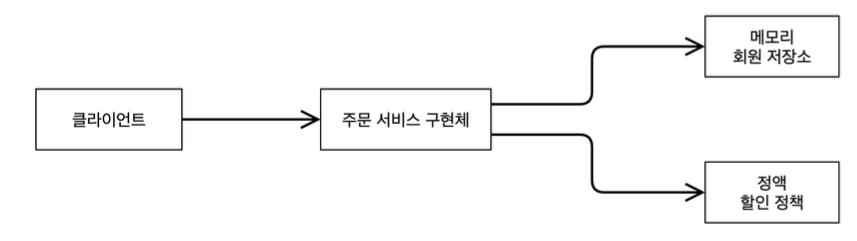
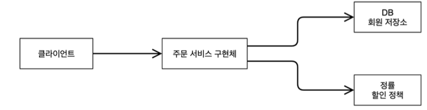

## 스프링 핵심 원리를 공부하기 위한 프로젝트

### 개요

- 이 프로젝트는 스프링 프레임워크의 핵심 원리를 공부하기 위한 프로젝트이며 스프링 프레임워크를 사용하면 편리한 부분을 코드로 구현해두었습니다.

#### 비즈니스 요구사항과 설계
해당 요구사항은 스프링 프레임워크 없이 구현이 가능하다 그러나 변경사항(DB로 변경, 할인 정책 변경 등)이 생길 경우 객체 지향 프로그래밍 원칙을 위반하는 일이 생긴다. 이것을 스프링 프레임워크 기능으로 해결하는 과정은 이 다음 요구사항에서 구현한다. 
- 회원
  - 회원을 가입하고 조회할 수 있다.
  - 회원은 일반과 VIP 두 가지 등급이 있다.
  - 회원 데이터는 자체 DB를 구축할 수 있고, 외부 시스템과 연동할 수 있다. (미확정)
- 주문과 할인 정책
  - 회원은 상품을 주문할 수 있다.
  - 회원 등급에 따라 할인 정책을 적용할 수 있다.
  - 할인 정책은 모든 VIP는 1000원을 할인해주는 고정 금액 할인을 적용해달라. (나중에 변경 될 수 있다.)
  - 할인 정책은 변경 가능성이 높다. 회사의 기본 할인 정책을 아직 정하지 못했고, 오픈 직전까지 고민을 미루고 싶다. 최악의 경우 할인을 적용하지 않을 수 도 있다. (미확정)

- 회원 도메인 설계
  - 회원 도메인 협력 관계
  
  - 회원 클래스 다이어그램
  
  - 회원 객체 다이어그램
  

- 주문과 할인 도메인 설계
  - 주문 도메인 협력, 역할, 책임
  
  - 주문 도메인 전체
  
  - 주문 도메인 클래스 다이어그램
  
  - 주문 도메인 객체 다이어그램1
    
  - 주문 도메인 객체 다이어그램2
    
  
#### 새로운 할인 정책 개발

- 새로운 할인 정책 개발
- 새로운 할인 정책을 확장해보자.
  - **악덕 기획자**: 서비스 오픈 직전에 할인 정책을 지금처럼 고정 금액 할인이 아니라 좀 더 합리적인 주문 금액당 할
  인하는 정률% 할인으로 변경하고 싶어요. 예를 들어서 기존 정책은 VIP가 10000원을 주문하든 20000원을 주
  문하든 항상 1000원을 할인했는데, 이번에 새로 나온 정책은 10%로 지정해두면 고객이 10000원 주문시 1000
  원을 할인해주고, 20000원 주문시에 2000원을 할인해주는 거에요!
  - **순진 개발자**: 제가 처음부터 고정 금액 할인은 아니라고 했잖아요.
  - **악덕 기획자**: 애자일 소프트웨어 개발 선언 몰라요? “계획을 따르기보다 변화에 대응하기를”
  - **순진 개발자**: … (하지만 난 유연한 설계가 가능하도록 객체지향 설계 원칙을 준수했지 후후)
  참고: 애자일 소프트웨어 개발 선언 https://agilemanifesto.org/iso/ko/manifesto.html
  
- 새로운 할인 정책 적용과 문제점
  - 할인 정책을 변경하려면 클라이언트인 `OrderServiceImpl` 코드를 고쳐야 한다.
  ```java
  public class OrderServiceImpl implements OrderService {
      // private final DiscountPolicy discountPolicy = new FixDiscountPolicy();
      private final DiscountPolicy discountPolicy = new RateDiscountPolicy();
  }
  ```
**문제점 발견**
- 우리는 역할과 구현을 충실하게 분리했다. OK
- 다형성도 활용하고, 인터페이스와 구현 객체를 분리했다. OK
- OCP, DIP 같은 객체지향 설계 원칙을 충실히 준수했다
  - 그렇게 보이지만 사실은 아니다.
- DIP: 주문서비스 클라이언트(`OrderServiceImpl` )는 `DiscountPolicy` 인터페이스에 의존하면서 DIP를
지킨 것 같은데?
  - 클래스 의존관계를 분석해 보자. 추상(인터페이스) 뿐만 아니라 **구체(구현) 클래스에도 의존**하고 있다.
    - 추상(인터페이스) 의존: `DiscountPolicy`
    - 구체(구현) 클래스: `FixDiscountPolicy` , `RateDiscountPolicy`
- OCP: 변경하지 않고 확장할 수 있다고 했는데!
  - **지금 코드는 기능을 확장해서 변경하면, 클라이언트 코드에 영향을 준다!** 따라서 **OCP를 위반**한다.

**인터페이스에만 의존하도록 코드 변경**
```java
public class OrderServiceImpl implements OrderService {
    //private final DiscountPolicy discountPolicy = new RateDiscountPolicy();
    private DiscountPolicy discountPolicy;
}
```
- 인터페이스에만 의존하도록 설계와 코드를 변경했다.
- **그런데 구현체가 없는데 어떻게 코드를 실행할 수 있을까?**
- 실제 실행을 해보면 NPE(null pointer exception)가 발생한다.

**해결방안**
- 이 문제를 해결하려면 누군가가 클라이언트인 `OrderServiceImpl` 에 `DiscountPolicy` 의 구현 객체를 대
신 생성하고 주입해주어야 한다.

## 관심사의 분리
- 애플리케이션을 하나의 공연이라 생각해보자. 각각의 인터페이스를 배역(배우 역할)이라 생각하자. 그런데! 실제
배역 맞는 배우를 선택하는 것은 누가 하는가?
- 로미오와 줄리엣 공연을 하면 로미오 역할을 누가 할지 줄리엣 역할을 누가 할지는 배우들이 정하는게 아니다. 이
전 코드는 마치 로미오 역할(인터페이스)을 하는 레오나르도 디카프리오(구현체, 배우)가 줄리엣 역할(인터페이
스)을 하는 여자 주인공(구현체, 배우)을 직접 초빙하는 것과 같다. 디카프리오는 공연도 해야하고 동시에 여자 주
인공도 공연에 직접 초빙해야 하는 **다양한 책임**을 가지고 있다.
## **관심사를 분리하자**
- 배우는 본인의 역할인 배역을 수행하는 것에만 집중해야 한다.
- 디카프리오는 어떤 여자 주인공이 선택되더라도 똑같이 공연을 할 수 있어야 한다.
- 공연을 구성하고, 담당 배우를 섭외하고, 역할에 맞는 배우를 지정하는 책임을 담당하는 별도의 **공연 기획자**가 나
올시점이다.
- 공연 기획자를 만들고, 배우와 공연 기획자의 책임을 확실히 분리하자.

## 좋은 객체 지향 설계의 5가지 원칙 적용
- 여기서 3가지 SRP, DIP, OCP 적용

### SRP 단일 책임 원칙

**한 클래스는 하나의 책임만 가져야 한다.**

  - 클라이언트 객체는 직접 구현 객체를 생성하고, 연결하고, 실행하는 다양한 책임을 가지고 있음
  - SRP 단일 책임 원칙을 따르면서 관심사를 분리함
  - 구현 객체를 생성하고 연결하는 책임은 AppConfig가 담당
  - 클라이언트 객체는 실행하는 책임만 담당

###  DIP 의존관계 역전 원칙
**프로그래머는 “추상화에 의존해야지, 구체화에 의존하면 안된다.” 의존성 주입은 이 원칙을 따르는 방법 중 하나다.**

  - 새로운 할인 정책을 개발하고, 적용하려고 하니 클라이언트 코드도 함께 변경해야 했다. 왜냐하면 기존 클라이언
  트 코드(`OrderServiceImpl` )는 DIP를 지키며 `DiscountPolicy` 추상화 인터페이스에 의존하는 것 같았
  지만, `FixDiscountPolicy` 구체화 구현 클래스에도 함께 의존했다.
  - 클라이언트 코드가 `DiscountPolicy` 추상화 인터페이스에만 의존하도록 코드를 변경했다.
  - 하지만 클라이언트 코드는 인터페이스만으로는 아무것도 실행할 수 없다.
  - AppConfig가 `FixDiscountPolicy` 객체 인스턴스를 클라이언트 코드 대신 생성해서 클라이언트 코드에 의
  존관계를 주입했다. 이렇게해서 DIP 원칙을 따르면서 문제도 해결했다.

### OCP
**소프트웨어 요소는 확장에는 열려 있으나 변경에는 닫혀 있어야 한다**
  - 다형성 사용하고 클라이언트가 DIP를 지킴
  - 애플리케이션을 사용 영역과 구성 영역으로 나눔
  - AppConfig가 의존관계를 `FixDiscountPolicy` `RateDiscountPolicy`
  에 주입하므로 클라이언트 코드는 변경하지 않아도 됨
  - **소프트웨어 요소를 새롭게 확장해도 사용 영역의 변경은 닫혀 있다!**

### 기술스택 
- Java 17
- Spring Boot 3.4.4
